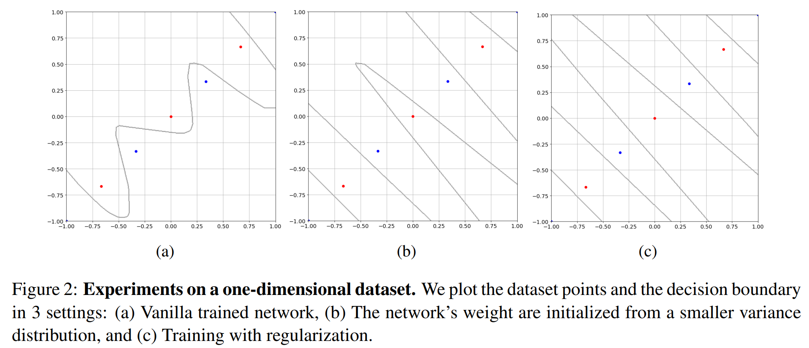

<h1 align=center> Adversarial Examples Exist in Two-Layer ReLU Networks for <br> Low Dimensional Linear Subspaces </h1> 
<p align=center><a href=https://odeliamel.github.io/odeliamelamed> Odelia Melamed </a>, <a href=https://sites.google.com/view/gyehudai/home> Gilad Yehudai </a>, <a href=https://sites.google.com/view/galvardi/home> Gal Vardi </a></p>
<p align=center>NeurIPS 2023 (<a href=https://openreview.net/pdf?id=pJbEXBBN88> Paper</a>)</p>


Python implementation of the experimental part of the paper. Follow the decision boundary of the binary classifier for two different low-dimensional datasets with 3 training methods.

## A one-dimensional diagonal line in a two-dimensional input space
<picture>
 <source media="(prefers-color-scheme: dark)" srcset="neurips2023-1dim.PNG">
 <source media="(prefers-color-scheme: light)" srcset="neurips2023-1dim.PNG">
 
</picture>

## A two-dimensional chessboard pattern in a three-dimensional input space.
<picture>
 <source media="(prefers-color-scheme: dark)" srcset="neurips2023-2dim.PNG">
 <source media="(prefers-color-scheme: light)" srcset="neurips2023-2dim.PNG">
 
</picture>

## BibTeX

```bib
@inproceedings{melamed2023adversarial,
 author = {Melamed, Odelia and Yehudai, Gilad and Vardi, Gal},
 booktitle = {Thirty-seventh Conference on Neural Information Processing Systems},
 title = {Adversarial Examples Exist in Two-Layer ReLU Networks for Low Dimensional Linear Subspaces},
 year = {2023}
}
```

